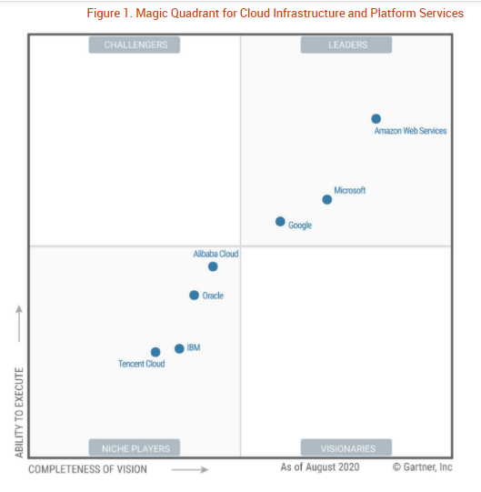

# Terraform provider prioritization

## Cloud-init support and 12 months free tier

### Oracle Cloud Infrastructure (already adopted)
- 2% global market share, 19 cities
- [Fixed startup discount](https://www.oracle.com/de/startup/) of 500 USD
- `oci_core_instance` ([Official API](https://registry.terraform.io/providers/hashicorp/oci/latest/docs/resources/core_instance))

### Amazon EC2 (already adopted)
- 33% global market share, 21 cities
- [Fixed startup discount](https://aws.amazon.com/de/activate/founders/) of 1350 USD
- `aws_instance` ([Official API](https://registry.terraform.io/providers/hashicorp/aws/latest/docs/resources/instance))

### Microsoft Azure
- 18% global market share, 52 cities
- Only B2B startups can receive credits beyond the free account
- `azurerm_linux_virtual_machne` ([Official API](https://registry.terraform.io/providers/hashicorp/azurerm/latest/docs/resources/linux_virtual_machine))
- Public IP address attribute: `public_ip_address`

### Alibaba Cloud
- 6% global market share, 22 cities
- [Startups can apply for](https://www.alibabacloud.com/de/startup/join-us) up to 10k USD 
- `alicloud_instance` ([Verified API](https://registry.terraform.io/providers/aliyun/alicloud/latest/docs/resources/instance))
- Public IP address attribute: `public_ip`

## Cloud-init support and 1 month free tier

### IBM Cloud
- 5% global market share, 8 cities
- [Startups can apply for](https://developer.ibm.com/startups/) up to 12k USD
- `ibm_compute_vm_instance` ([Community API](https://registry.terraform.io/providers/IBM-Cloud/ibm/latest/docs/resources/compute_vm_instance))
- Public IP address attribute: `ipv4_address`

### OVH Cloud
- 11 cities 
- [Startups can apply for](https://startup.ovhcloud.com/en/starters/) up to 10k EUR
- `openstack_compute_instance_v2` ([Verified API](https://registry.terraform.io/providers/terraform-provider-openstack/openstack/latest/docs/resources/compute_instance_v2))
- Public IP address attribute: `access_ip_v4`

### Digital Ocean
- 11 cities
- Only approved accelerators
- `digitalocean_droplet` ([Verified API](https://registry.terraform.io/providers/digitalocean/digitalocean/latest/docs/resources/droplet))
- Public IP address attribute: `ipv4_address`

### OpenTelekomCloud
- 2 cities
- [Startups can apply for](https://telekomhilft.telekom.de/t5/TechBoost/ct-p/techboost) 15k EUR
- `opentelekomcloud_compute_instance_v2` ([Community API](https://registry.terraform.io/providers/opentelekomcloud/opentelekomcloud/latest/docs/resources/compute_instance_v2))
- Public IP address attribute: `access_ip_v4`

### Yandex.Cloud
- 3 cities
- [Startups can apply for](https://cloud.yandex.com/cloud-boost) up to 12k USD
- `yandex_compute_instance` ([Community API](https://registry.terraform.io/providers/yandex-cloud/yandex/latest/docs/resources/compute_instance))
- Public IP address attribute: `network_interface.0.nat_ip_address`

## Cloud-init support but no free tier with sufficient RAM allowance

### Google Compute Engine
- 9% global market share, 3 cities
- Only approved accelerators
- `google_compute_instance` ([Official API](https://registry.terraform.io/providers/hashicorp/google/latest/docs/resources/compute_instance))
- Public IP address attribute: `network_interface.0.access_config.0.nat_ip`

### TencentCloud
- 2% global market share, 15 cities
- No startup program
- `tencentcloud_instance` ([Verified API](https://registry.terraform.io/providers/tencentcloudstack/tencentcloud/latest/docs/resources/instance))
- Public IP address attribute: `public_ip`

## Aggregate Locations

Currently deployable in 33 cities worldwide (and counting):

- Australia
  - Melbourne
  - Sydney
  - Canberra (soon with Azure)
- Bahrain
  - Manama
- Brazil
  - São Paulo
- Canada
  - Montreal
  - Toronto
    Quebec City (soon with Azure)
- China
  - Beijing
  - Hong Kong
  - Ningxiang
  - Chengdu (soon with Alibaba)
  - Hangzhou (soon with Alibaba)
  - Heyuan (soon with Alibaba)
  - Hohhot (soon with Alibaba)
  - Qingdao (soon with Alibaba)
  - Shanghai (soon with Alibaba or Azure)
  - Shenzhen (soon with Alibaba)
  - Zhangjiakou (soon with Alibaba)
- France
  - Marseille (soon with Azure)
  - Paris
- Germany
  - Berlin (soon with Azure)
  - Frankfurt
  - Magdeburg (soon with Azure)
- India
  - Chennai (soon with Azure)
  - Hyderabad
  - Mumbai
  - Pune (soon with Azure)
- Indonesia
  - Jakarta (soon with Alibaba)
- Ireland
  - Dublin
- Italy
  - Milan
- Japan
  - Osaka
  - Saitama (soon with Azure)
  - Tokyo
- Malaysia
  - Kuala Lumpur (soon with Alibaba)
- Netherlands
  - Amsterdam
  - Middenmeer (soon with Azure)
- Norway
  - Oslo (Azure)
  - Stavanger (soon with Azure)
- Saudi Arabia
  - Jeddah
- Singapore
- South Africa
  - Cape Town
  - Johannesburg (soon with Azure)
- South Korea
  - Busan (soon with Azure)
  - Chuncheon
  - Seoul
- Sweden
  - Stockholm
- Switzerland
  - Geneva (soon with Azure)
  - Zürich
- United Arab Emirates
  - Abu Dhabi (soon with Azure)
  - Dubai (soon with Azure or Alibaba)
- United Kingdom
  - Cardiff (soon with Azure)
  - London
- United States
  - Ashburn, Virginia
  - Austin, Texas (soon with Azure)
  - Boardman, Oregon
  - Cheyenne, Wyoming (soon with Azure)
  - Chicago, Illinois (soon with Azure)
  - Des Moines, Iowa (soon with Azure)
  - Hilliard, Ohio
  - Phoenix, Arizona
  - San Francisco, California
  - San Jose, California
  - Washington, D.C.
  - Quincy, WA (soon with Azure)
  - Richmond, Virginia (soon with Azure)
  - San Antonio, TX (soon with Azure)
