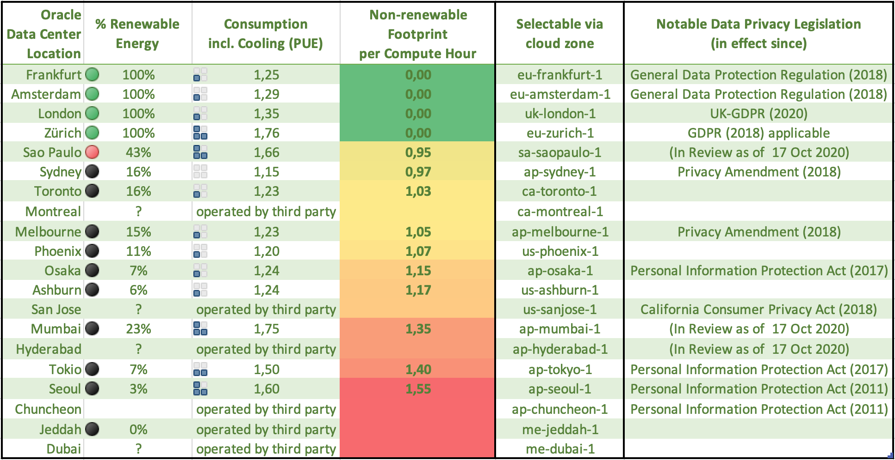

# What are the main features?

Isomorphisms between
- Git branch
- Terraform workspace
- OCI compartment
- DNS zone

<table border="0">
 <tr>
    <td><b style="font-size:30px">Desktop node</b></td>
    <td><b style="font-size:30px">Gateway node</b></td>
 </tr>
 <tr>
   <td>
     <ul>
       <li>Ubuntu 20.04 LTS</li>
       <li>Light weight LXQt Desktop</li>
       <li>Participates as Mumble user</li>
       <li>Record conference audio</li>
       <li>Listen to music or podcasts together</li>
     </ul>
   </td>
   <td>
     <ul>
       <li>In-browser remote desktop using Apache Guacamole</li>
       <li>Mumble audio server backend within Docker</li>
       <li>In-browser high-quality audio conferencing</li>
       <li>Dockerized Dovecot IMAP Server</li>
     </ul>
   </td>
 </tr>
</table>

# Energy Consumption and Privacy Legislation

Source: https://www.oracle.com/de/cloud/data-regions.html

# Market Analysis and Unique Selling Point

[Microsoft Teams](https://www.microsoft.com/en-us/microsoft-365/microsoft-teams/group-chat-software/) integrates Skype with Outlook and SharePoint. You can store files in the cloud and share your local desktop with other meeting participants, but there is no  virtual cloud desktop that everyone can access. Same appplies to their direct competitor Slack. Also, sharing the local desktop works rather lousy because it involves a video uplink on a asymmetric connection.

Existing virtual desktop solutions are all closed-source offers to the business world. The top players in this market are:

- [Nutanix](https://www.nutanix.com/de/products/frame) testen!
- [Itopia](https://itopia.com/) testen!
- [Mikogo Cloud Desktop](https://www.mikogo.com/cloud-desktop/) testen!
- [V2 Cloud](https://v2cloud.com) testen!
- [Windows Desktop on Azure](https://azure.microsoft.com/en-us/services/virtual-desktop/)
- [Amazon WorkSpaces](https://aws.amazon.com/de/workspaces/?workspaces-blogs.sort-by=item.additionalFields.createdDate&workspaces-blogs.sort-order=desc)
- [Oracle Secure Global Desktops](https://www.oracle.com/ae/secure-global-desktop/)

Some of these solutions might include collaboration and conferencing components (research yet to be completed), but it is certainly not their focus.

We also do not intend to compete with commercial video conferencing solutions like Zoom or WebEx for two reasons. First, they are too big and established. Second, there is already [Zoom fatigue](https://www.ardaudiothek.de/ab-21/gaehn-warum-uns-videocalls-so-muede-machen/76335364) and absurd work arounds like background substitution requiring the application of energy consuming deep learning models.

Instead we focus on:
- unsurpassed audio quality and low bandwidth usage
- zero-install on client side
- simpler to setup than other more video focussed open source servers like Jitsi or BigBlueButton
- works from free tier virtual machines upwards
- affordable for small clubs, schools and NGOs
- data privacy through separate VM and strong encryption
- no metadata collection of communications
- choice of server location and agnostic of cloud provider
- so you can combine free VM from e.g Amazon and Google Cloud
- custom domain and customization of provisioned software
- automated and reproducable provisioning of the environment
- include tools for DevOps users and software testing

Still look at:
- Studio Code Live Share
- Heroku
- https://jamm.app/en/

https://gerrymcgovern.com/the-hidden-pollution-cost-of-online-meetings/

https://ourworldindata.org/internet
https://ourworldindata.org/mental-health

Data privacy, intellectual property and saving the climate all at the same time :-)

# Potential Testers / Early Adopters

- Papa um uns Unterlagen für Wipperfliess zu zeigen
- Lea für Stationsversammlung mit OpenSlides
- Ying zum Demonstrieren Ihrer eigenen App
- Werner zum Qt-Programmieren
- Selbsthilfebüro für Karaoke-Abend
- Achim bei der Bahn für Mob Programming
- Björn für CdE-Orga

# Minimal Requirements

- 2 VMs with 1 GB of RAM each (available for free from e.g. [Oracle Cloud](https://www.oracle.com/cloud/))
- not necessarily with the same cloud provider (cloud-agnostic)
- 100 kbit/s uplink at the user's location
- Server must have the following open ports: 22 (SSH), 443 (SSL)
- Nice to have open server ports: 64738 (Mumble), 25 (SMTP)

# Unique Selling Point(s)

- receive email on project specific email account
- PaaS between Saas and IaaS
- desktop sharing done right
- persistent storage of your docs
- everyone is able to edit without need for switching controls
- hear each other crystal clear, listen to podcasts and more
- until all is said: no time limitations whatsoever
- no additional software: use your favorite web browser
- keep your private space private: no webcams involved

# Technical details
- SSH tunnnel between desktop and gateway across clouds and borders
- For example: Gateway on Azure within the US, while desktop on Alibaba in China
- one-click install on free tier cloud infrastructure
- communication between servers and clients always encrypted
- stable, yet resource-friendly conferencing even at low bandwidth
- low latency, high quality
- now video, at least no upload
- idea exchange reduced to the max
- exactly what we need during Corona
- and did we mention: it's free
- mumble.com charges 7.50$ a month for up to 15 users (without desktop!!)
- [Mumble](https://www.mumble.info) and [VNC](https://en.wikipedia.org/wiki/Virtual_Network_Computing) both over HTTPS
- [SSH tunnel](https://www.ssh.com/ssh/tunneling/) secured with [ed25519 encryption](http://ed25519.cr.yp.to)
- fast network connection in the cloud
- usable with standard set of open ports (22 SSH, 443 HTTPS)
- access (multiple) desktops via one central gateway, no need to remember IPs
- [nginx](https://docs.nginx.com/nginx/admin-guide/web-server/) and murmur share SSL certificate form [LetsEncrypt](https://letsencrypt.org)
- Prevention of full RAM and swapping
- some more cool arcade games and selection of games for kids
- lightweight [LXQt desktop](https://lxqt.github.io) with beautiful [ePapirus icons](https://github.com/PapirusDevelopmentTeam/papirus-icon-theme) and breeze theme
- [gPodder](https://gpodder.github.io) podcatcher connected with [VLC](https://www.videolan.org/vlc/index.html) media player
- list of my favorite podcasts in OPML format
- desktop takes part in Mumble conference, ability to record
- [Opus](https://opus-codec.org) audio codec
- Automatic [Trojita](http://trojita.flaska.net) email client configuration
- separate VMs for desktop and gateway, both deployed in parallel
- basic architecture diagram in structurizr according to the [C4 model](https://c4model.com)
- [Openbox](https://en.wikipedia.org/wiki/Openbox) window manager
- rock-solid [x11vnc](http://www.karlrunge.com/x11vnc/) server
- chose Oracle Cloud mainly because two free VMs
- using [Docker Compose](https://docs.docker.com/compose/)
- VM will register itself as Gitlab
- Automatically add tags describing the host when registering gitlab runner
- Based on [Ubuntu Focal Fossa](https://wiki.ubuntu.com/FocalFossa/ReleaseNotes) which has long term support until April 2025

# Use cases

## gPodder + VLC + Mumble use cases
- Corona Karaoke including 3D audio, bring-your-own-alcohol if you like
- Listening to and discussing podcasts together
- Listening to Audio porn together

## Web browser use cases
- Collaborative planning of e.g. travel over distance
- Doing e-learning together

## Docker + GitLab Runner use cases
- Software demos and user testing
- Mob programming
- Digitale Vereinssitzung, Konkurrenzsoftware OpenSlides

## Other use cases
- Presenting and discussing slides
- Virtual conference table with positional audio
- Project management files and conferencing in one place
- Secretary work, virtual personal assistant

# Todos and planned features

- Migrate from Packer to Terraform Cloud
- Crowdfunding campaign

