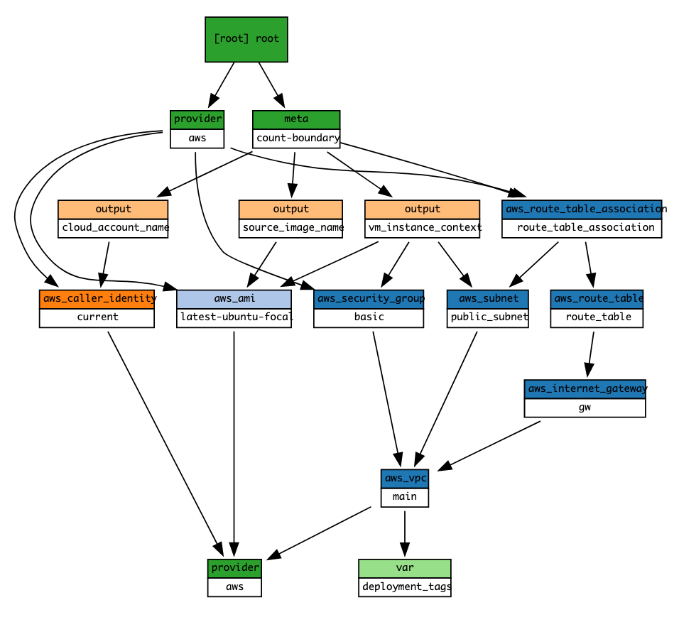

# AWS common infrastructure Terraform module

Terraform module which creates common resources on AWS.

## Usage

```hcl
module "amazon_infrastructure" {
  deployment_tags = local.deployment_tags
  source          = "./modules/terraform-aws-commons"
}
```

## Structure



<!-- BEGINNING OF PRE-COMMIT-TERRAFORM DOCS HOOK -->
## Requirements

| Name | Version |
|------|---------|
| terraform | >= 0.12.26 |
| aws | ~> 3.18 |

## Providers

| Name | Version |
|------|---------|
| aws | ~> 3.18 |

## Inputs

| Name | Description | Type | Default | Required |
|------|-------------|------|---------|:--------:|
| deployment\_tags | n/a | `map(string)` | n/a | yes |

## Outputs

| Name | Description |
|------|-------------|
| additional\_metadata | n/a |
| vm\_creation\_context | n/a |

<!-- END OF PRE-COMMIT-TERRAFORM DOCS HOOK -->
