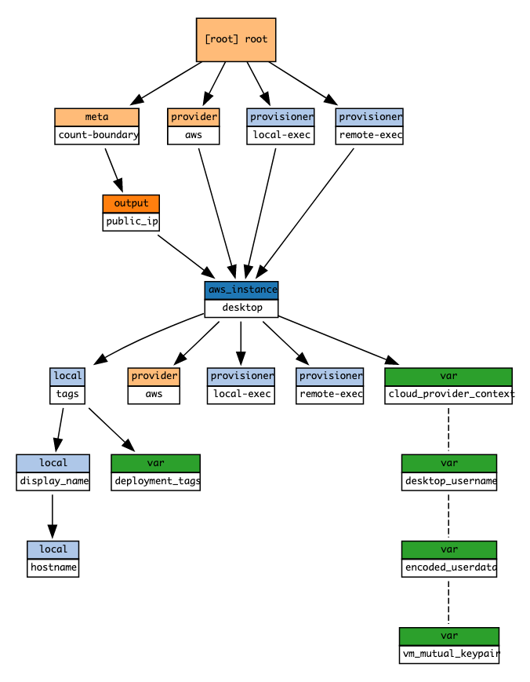

# AWS desktop infrastructure Terraform module

Terraform module which creates desktop resources on AWS.

## Usage

```hcl
module "amazon_infrastructure" {
  deployment_tags = local.deployment_tags
  source          = "./modules/terraform-aws-commons"
}

module "desktop_machine_1" {
  deployment_tags   = local.deployment_tags
  desktop_username  = module.credentials_generator.desktop_username
  encoded_userdata  = local.encoded_desktop_config
  vm_mutual_keypair = module.credentials_generator.vm_mutual_key
  depends_on = [
    # Desktop without gateway would be of little use
    module.gateway_installer
  ]
  source = "./modules/terraform-aws-desktop"
  // below variables are provider specific
  cloud_provider_context = module.amazon_infrastructure.vm_creation_context
}
```

## Structure



<!-- BEGINNING OF PRE-COMMIT-TERRAFORM DOCS HOOK -->
## Requirements

| Name | Version |
|------|---------|
| terraform | >= 0.12.26 |
| aws | ~> 3.18 |

## Providers

| Name | Version |
|------|---------|
| aws | ~> 3.18 |

## Inputs

| Name | Description | Type | Default | Required |
|------|-------------|------|---------|:--------:|
| cloud\_provider\_context | n/a | <pre>object({<br>    vpc_id                   = string<br>    subnet_id                = string<br>    shared_security_group_id = string<br>    source_image_id          = string<br>    minimum_viable_shape     = string<br>  })</pre> | n/a | yes |
| deployment\_tags | n/a | `map(string)` | n/a | yes |
| desktop\_username | n/a | `string` | n/a | yes |
| encoded\_userdata | n/a | `string` | n/a | yes |
| vm\_mutual\_keypair | n/a | <pre>object({<br>    private_key_pem    = string<br>    public_key_openssh = string<br>  })</pre> | n/a | yes |

## Outputs

| Name | Description |
|------|-------------|
| public\_ip | n/a |

<!-- END OF PRE-COMMIT-TERRAFORM DOCS HOOK -->
