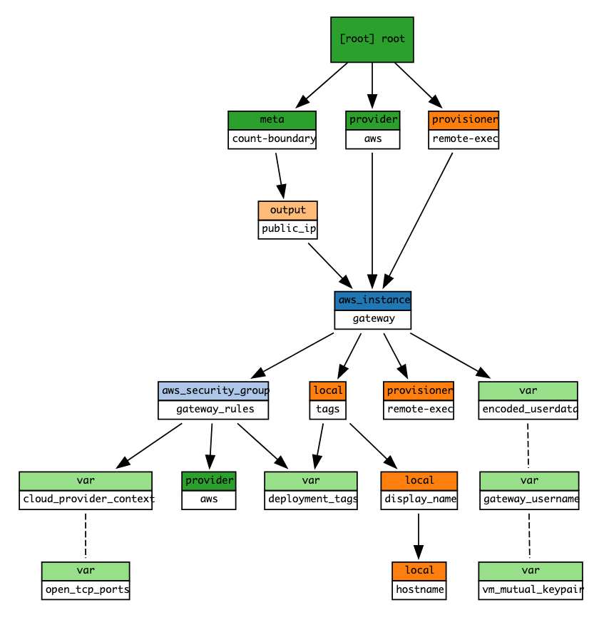

# AWS gateway infrastructure Terraform module

Terraform module which creates gateway resources on AWS.

## Usage

```hcl
module "amazon_infrastructure" {
  deployment_tags = local.deployment_tags
  source          = "./modules/terraform-aws-commons"
}

module "gateway_machine" {
  deployment_tags   = local.deployment_tags
  gateway_username  = module.credentials_generator.gateway_username
  encoded_userdata  = local.encoded_gateway_config
  vm_mutual_keypair = module.credentials_generator.vm_mutual_key
  open_tcp_ports = {
    ssh    = 22
    https  = 443
    http   = 80
    mumble = module.credentials_generator.murmur_credentials.port
    smtp   = module.credentials_generator.email_config.smtp_port
  }
  source = "./modules/terraform-aws-gateway"
  // below variables are provider specific
  cloud_provider_context = module.amazon_infrastructure.vm_creation_context
}
```

## Structure


