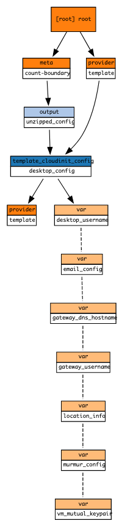

# Desktop cloud-init Terraform module

Terraform module which generates cloud-init userdata for provisioning the desktop.

## Containers and components (C4 arch model)

- Desktop
  - some more cool arcade games and selection of games for kids
  - lightweight [LXQt desktop](https://lxqt.github.io) with beautiful [ePapirus icons](https://github.com/PapirusDevelopmentTeam/papirus-icon-theme) and breeze theme
  - [Openbox](https://en.wikipedia.org/wiki/Openbox) window manager
  - rock-solid [x11vnc](http://www.karlrunge.com/x11vnc/) server
  - [VNC](https://en.wikipedia.org/wiki/Virtual_Network_Computing)
  - Prevention of full RAM and swapping
  - everyone is able to edit without need for switching controls
  - persistent storage of your docs
- Audio
  - Participates as additional Mumble user
  - Record conference audio
  - [gPodder](https://gpodder.github.io) podcatcher connected with [VLC](https://www.videolan.org/vlc/index.html) media player
  - list of my favorite podcasts in OPML format
  - desktop takes part in Mumble conference, ability to record
- Email
  - Automatic [Trojita](http://trojita.flaska.net) email client configuration
- Use case specific software


## Usage

```hcl
module "desktop_installer" {
  timezone_name        = var.timezone
  locale_name          = var.locale
  vm_mutual_keypair    = module.credentials_generator.vm_mutual_key
  gateway_username     = module.credentials_generator.gateway_username
  desktop_username     = module.credentials_generator.desktop_username
  primary_nic_name     = module.credentials_generator.desktop_primary_nic_name
  murmur_config        = module.credentials_generator.murmur_credentials
  gateway_dns_hostname = module.credentials_generator.full_hostname
  email_config         = module.credentials_generator.email_config
  source               = "./modules/terraform-cloudinit-desktop"
}
```

## Structure



<!-- BEGINNING OF PRE-COMMIT-TERRAFORM DOCS HOOK -->
## Requirements

| Name | Version |
|------|---------|
| terraform | >= 0.12.26 |
| template | ~> 2.2.0 |

## Providers

| Name | Version |
|------|---------|
| template | ~> 2.2.0 |

## Inputs

| Name | Description | Type | Default | Required |
|------|-------------|------|---------|:--------:|
| browser\_url | n/a | `string` | n/a | yes |
| desktop\_username | Username for logging in to Ubuntu on the desktop node | `string` | n/a | yes |
| email\_config | n/a | <pre>object({<br>    address   = string<br>    password  = string<br>    imap_port = number<br>    smtp_port = number<br>  })</pre> | n/a | yes |
| gateway\_dns\_hostname | n/a | `string` | n/a | yes |
| gateway\_username | Username for logging in to Ubuntu on the gateway node | `string` | n/a | yes |
| locale\_name | n/a | `string` | `"de_DE.UTF-8"` | no |
| murmur\_config | n/a | <pre>object({<br>    port     = number<br>    password = string<br>  })</pre> | n/a | yes |
| primary\_nic\_name | n/a | `string` | n/a | yes |
| timezone\_name | The name of the common system time zone applied to both VMs | `string` | `"Europe/Berlin"` | no |
| vm\_mutual\_keypair | n/a | <pre>object({<br>    private_key_pem    = string<br>    public_key_openssh = string<br>  })</pre> | n/a | yes |

## Outputs

| Name | Description |
|------|-------------|
| unzipped\_config | n/a |

<!-- END OF PRE-COMMIT-TERRAFORM DOCS HOOK -->
