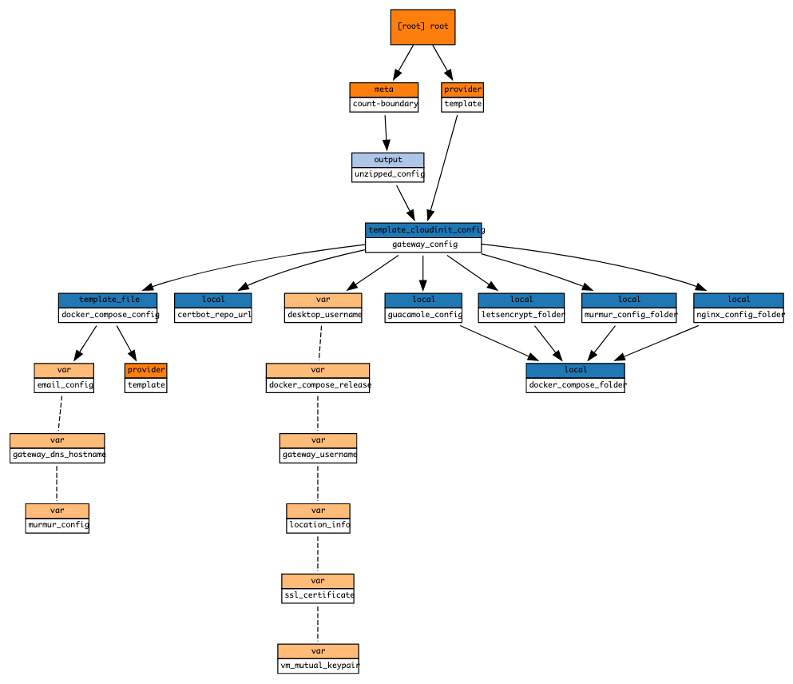

# Gateway cloud-init Terraform module

Terraform module which generates cloud-init userdata for provisioning the gateway.

## Containers and components (C4 arch model)

- Webserver
  - [nginx](https://docs.nginx.com/nginx/admin-guide/web-server/) Docker image
- Desktop
  - [guacamole/guacamole](https://hub.docker.com/r/guacamole/guacamole) Docker image
  - [guacamole/guacd](https://hub.docker.com/r/guacamole/guacd) Docker container
  - [postgres](https://hub.docker.com/_/postgres) Docker image
- Audio
  - [goofball222/murmur](https://hub.docker.com/r/goofball222/murmur) Docker image
  - [jafudi/mumble-web-lite](https://github.com/jafudi/mumble-web) Docker image
- Email
  - Dockerized Dovecot IMAP Server [antespi/docker-imap-devel](https://hub.docker.com/r/antespi/docker-imap-devel)

## Usage

```hcl
module "gateway_installer" {
  timezone_name          = var.timezone
  locale_name            = var.locale
  vm_mutual_keypair      = module.credentials_generator.vm_mutual_key
  gateway_username       = module.credentials_generator.gateway_username
  desktop_username       = module.credentials_generator.desktop_username
  primary_nic_name       = module.credentials_generator.gateway_primary_nic_name
  ssl_certificate        = module.credentials_generator.letsencrypt_certificate
  murmur_config          = module.credentials_generator.murmur_credentials
  gateway_dns_hostname   = module.credentials_generator.full_hostname
  email_config           = module.credentials_generator.email_config
  docker_compose_release = local.docker_compose_release
  source                 = "./modules/terraform-cloudinit-gateway"
}
```

## Structure



<!-- BEGINNING OF PRE-COMMIT-TERRAFORM DOCS HOOK -->
## Requirements

| Name | Version |
|------|---------|
| terraform | >= 0.12.26 |
| template | ~> 2.2.0 |

## Providers

| Name | Version |
|------|---------|
| random | n/a |
| template | ~> 2.2.0 |

## Inputs

| Name | Description | Type | Default | Required |
|------|-------------|------|---------|:--------:|
| desktop\_username | Username for logging in to Ubuntu on the desktop node | `string` | n/a | yes |
| docker\_compose\_release | n/a | `string` | n/a | yes |
| email\_config | n/a | <pre>object({<br>    address   = string<br>    password  = string<br>    imap_port = number<br>    smtp_port = number<br>  })</pre> | n/a | yes |
| gateway\_dns\_hostname | n/a | `string` | n/a | yes |
| gateway\_username | Username for logging in to Ubuntu on the gateway node | `string` | n/a | yes |
| locale\_name | n/a | `string` | `"de_DE.UTF-8"` | no |
| murmur\_config | n/a | <pre>object({<br>    port     = number<br>    password = string<br>  })</pre> | n/a | yes |
| primary\_nic\_name | n/a | `string` | n/a | yes |
| ssl\_certificate | n/a | <pre>object({<br>    private_key_pem = string<br>    certificate_pem = string<br>    issuer_pem      = string<br>  })</pre> | n/a | yes |
| timezone\_name | The name of the common system time zone applied to both VMs | `string` | `"Europe/Berlin"` | no |
| vm\_mutual\_keypair | n/a | <pre>object({<br>    private_key_pem    = string<br>    public_key_openssh = string<br>  })</pre> | n/a | yes |

## Outputs

| Name | Description |
|------|-------------|
| unzipped\_config | n/a |

<!-- END OF PRE-COMMIT-TERRAFORM DOCS HOOK -->
