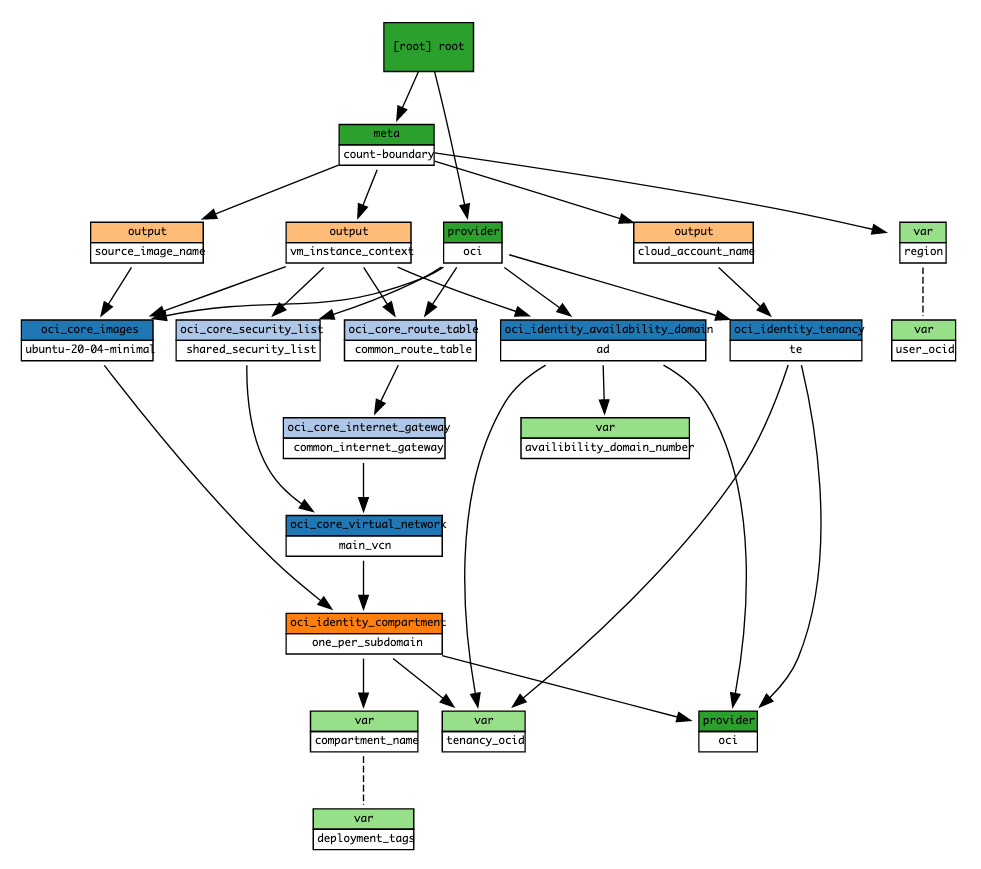

# OCI common infrastructure Terraform module

Terraform module which creates common resources on OCI.

- chose Oracle Cloud mainly because two free VMs

## Usage

```hcl
module "oracle_infrastructure" {
  deployment_tags = local.deployment_tags
  source          = "./modules/terraform-oci-commons"
  // below variables are provider specific
  tenancy_ocid               = var.oci_tenancy_ocid
  user_ocid                  = var.oci_user_ocid
  region                     = var.oci_region
  availibility_domain_number = var.oci_free_tier_avail
  compartment_name           = var.TFC_WORKSPACE_NAME
}
```

## Structure



<!-- BEGINNING OF PRE-COMMIT-TERRAFORM DOCS HOOK -->
## Requirements

| Name | Version |
|------|---------|
| terraform | >= 0.12.26 |
| oci | ~> 3.95.0 |

## Providers

| Name | Version |
|------|---------|
| oci | ~> 3.95.0 |

## Inputs

| Name | Description | Type | Default | Required |
|------|-------------|------|---------|:--------:|
| availibility\_domain\_number | n/a | `number` | n/a | yes |
| compartment\_name | n/a | `string` | n/a | yes |
| deployment\_tags | n/a | `map(string)` | n/a | yes |
| region | Must be equal to the home region of the tenancy. | `string` | n/a | yes |
| tenancy\_ocid | Oracle Cloud ID (OCID) of the tenancy | `string` | n/a | yes |
| user\_ocid | The user's Oracle Cloud ID (OCID) | `string` | n/a | yes |

## Outputs

| Name | Description |
|------|-------------|
| additional\_metadata | n/a |
| vm\_creation\_context | n/a |

<!-- END OF PRE-COMMIT-TERRAFORM DOCS HOOK -->
