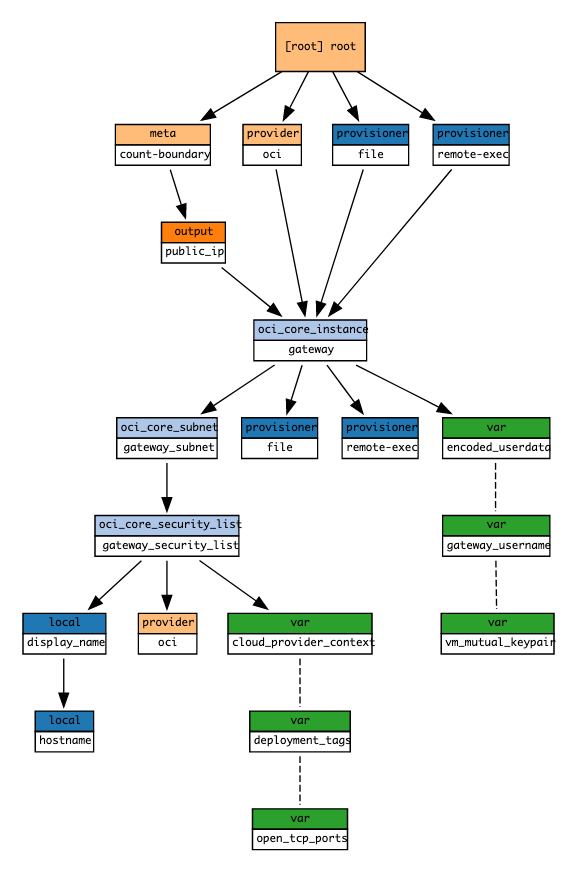

# OCI gateway infrastructure Terraform module

Terraform module which creates gateway resources on OCI.

## Usage

```hcl
module "oracle_infrastructure" {
  deployment_tags = local.deployment_tags
  source          = "./modules/terraform-oci-commons"
  // below variables are provider specific
  tenancy_ocid               = var.oci_tenancy_ocid
  user_ocid                  = var.oci_user_ocid
  region                     = var.oci_region
  availibility_domain_number = var.oci_free_tier_avail
  compartment_name           = var.TFC_WORKSPACE_NAME
}

module "gateway_machine" {
  deployment_tags   = local.deployment_tags
  gateway_username  = module.credentials_generator.gateway_username
  encoded_userdata  = local.encoded_gateway_config
  vm_mutual_keypair = module.credentials_generator.vm_mutual_key
  open_tcp_ports = {
    ssh    = 22
    https  = 443
    http   = 80
    mumble = module.credentials_generator.murmur_credentials.port
    smtp   = module.credentials_generator.email_config.smtp_port
  }
  source = "./modules/terraform-oci-gateway"
  // below variables are provider specific
  cloud_provider_context = module.oracle_infrastructure.vm_creation_context
}
```

## Structure



<!-- BEGINNING OF PRE-COMMIT-TERRAFORM DOCS HOOK -->
## Requirements

| Name | Version |
|------|---------|
| terraform | >= 0.12.26 |
| oci | ~> 3.95.0 |

## Providers

| Name | Version |
|------|---------|
| oci | ~> 3.95.0 |

## Inputs

| Name | Description | Type | Default | Required |
|------|-------------|------|---------|:--------:|
| cloud\_provider\_context | n/a | <pre>object({<br>    vcn_id                   = string<br>    route_table_id           = string<br>    dhcp_options_id          = string<br>    security_list_id         = string<br>    availability_domain_name = string<br>    compartment_id           = string<br>    source_image_id          = string<br>    minimum_viable_shape     = string<br>  })</pre> | n/a | yes |
| deployment\_tags | n/a | `map(string)` | n/a | yes |
| encoded\_userdata | n/a | `string` | n/a | yes |
| gateway\_username | n/a | `string` | n/a | yes |
| open\_tcp\_ports | n/a | `map(number)` | `{}` | no |
| vm\_mutual\_keypair | n/a | <pre>object({<br>    private_key_pem    = string<br>    public_key_openssh = string<br>  })</pre> | n/a | yes |

## Outputs

| Name | Description |
|------|-------------|
| public\_ip | n/a |

<!-- END OF PRE-COMMIT-TERRAFORM DOCS HOOK -->