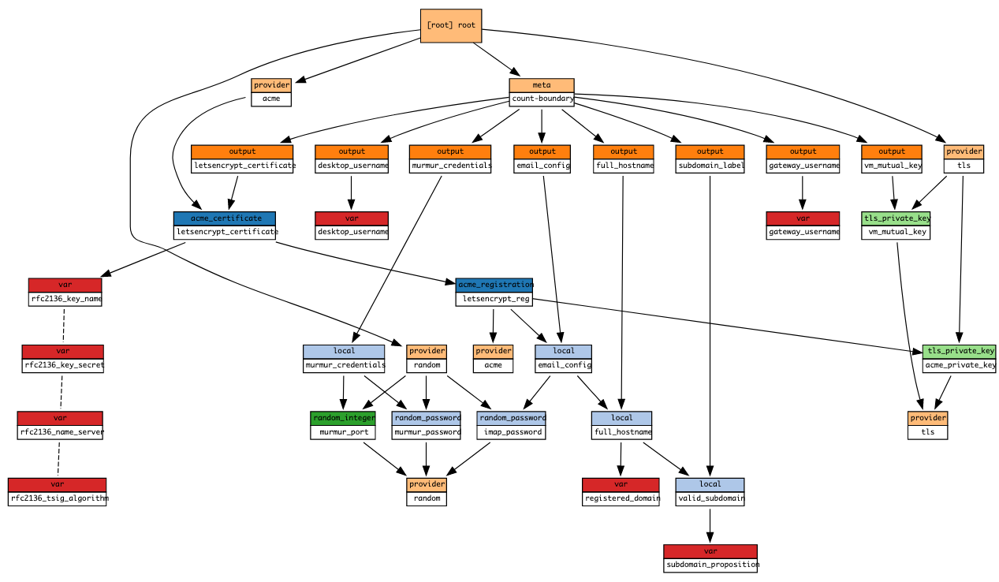

# TLS credentials Terraform module

Terraform module which generates a Letsencrypt TLS certificate and other credentials.

## Containers and components (C4 arch model)

- TLS certificate
  - public key
  - private key
- DNS A record
  - ...

## Usage

```hcl
module "credentials_generator" {
  registered_domain     = var.registered_domain
  subdomain_proposition = "${var.TFC_CONFIGURATION_VERSION_GIT_BRANCH}-branch-${var.TFC_WORKSPACE_NAME}"
  gateway_cloud_info    = module.oracle_infrastructure.additional_metadata
  desktop_cloud_info    = module.amazon_infrastructure.additional_metadata
  source                = "./modules/terraform-tls-credentials"
  // below variables are provider specific
  rfc2136_name_server    = var.rfc2136_name_server
  rfc2136_key_name       = var.rfc2136_key_name
  rfc2136_key_secret     = var.rfc2136_key_secret
  rfc2136_tsig_algorithm = var.rfc2136_tsig_algorithm
}
```

## Structure



<!-- BEGINNING OF PRE-COMMIT-TERRAFORM DOCS HOOK -->
## Requirements

| Name | Version |
|------|---------|
| terraform | >= 0.12.26 |
| acme | ~> 1.5.0 |
| random | ~> 2.3.0 |
| tls | ~> 2.2.0 |

## Providers

| Name | Version |
|------|---------|
| acme | ~> 1.5.0 |
| random | ~> 2.3.0 |
| tls | ~> 2.2.0 |

## Modules

No Modules.

## Resources

| Name |
|------|
| [acme_certificate](https://registry.terraform.io/providers/terraform-providers/acme/latest/docs/resources/certificate) |
| [acme_registration](https://registry.terraform.io/providers/terraform-providers/acme/latest/docs/resources/registration) |
| [random_integer](https://registry.terraform.io/providers/hashicorp/random/latest/docs/resources/integer) |
| [random_password](https://registry.terraform.io/providers/hashicorp/random/latest/docs/resources/password) |
| [tls_private_key](https://registry.terraform.io/providers/hashicorp/tls/latest/docs/resources/private_key) |

## Inputs

| Name | Description | Type | Default | Required |
|------|-------------|------|---------|:--------:|
| desktop\_cloud\_info | n/a | <pre>object({<br>    cloud_account_name     = string<br>    source_image_info      = string<br>    network_interface_name = string<br>  })</pre> | n/a | yes |
| gateway\_cloud\_info | n/a | <pre>object({<br>    cloud_account_name     = string<br>    source_image_info      = string<br>    network_interface_name = string<br>  })</pre> | n/a | yes |
| registered\_domain | n/a | `string` | n/a | yes |
| rfc2136\_key\_name | n/a | `string` | n/a | yes |
| rfc2136\_key\_secret | n/a | `string` | n/a | yes |
| rfc2136\_name\_server | n/a | `string` | n/a | yes |
| rfc2136\_tsig\_algorithm | n/a | `string` | n/a | yes |
| subdomain\_proposition | n/a | `string` | n/a | yes |

## Outputs

| Name | Description |
|------|-------------|
| browser\_url | n/a |
| desktop\_primary\_nic\_name | n/a |
| desktop\_username | Making sure the first character is a lower case roman letter |
| email\_config | n/a |
| full\_hostname | n/a |
| gateway\_primary\_nic\_name | n/a |
| gateway\_username | Make sure the first character is a lower case roman letter |
| letsencrypt\_certificate | n/a |
| mumble\_url | n/a |
| murmur\_credentials | n/a |
| subdomain\_label | n/a |
| vm\_mutual\_key | n/a |
| vnc\_port | Randomly chosen VNC port increases security |
<!-- END OF PRE-COMMIT-TERRAFORM DOCS HOOK -->
